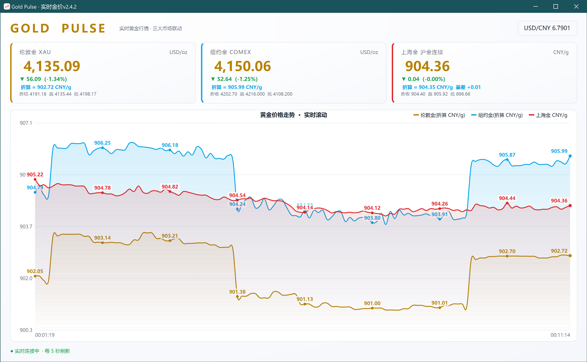

# Gold Pulse · 实时金价

实时黄金行情桌面看板，一屏聚合伦敦金、纽约金、上海金三大市场。

## 功能

- **三大市场同屏**：伦敦金（XAU）、纽约金（COMEX）、上海金（沪金连续）实时价格与涨跌。
- **汇率与折算**：显示 USD/CNY 实时汇率，并自动将国际金价折算为人民币克价，与上海金对比显示基差。
- **平滑走势图**：三大市场价格联动走势，滚动更新，数据点带数值标记。
- **文字可复制**：所有价格、文字均可用鼠标选中，按 Ctrl+C 复制。
- **每 5 秒自动刷新**。
